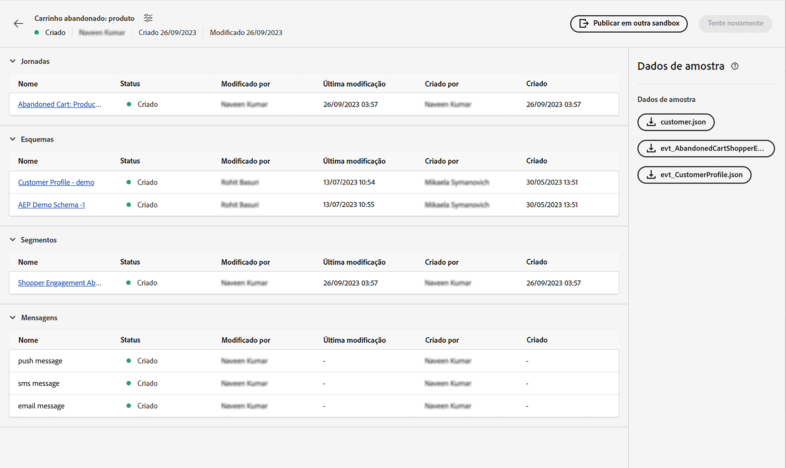
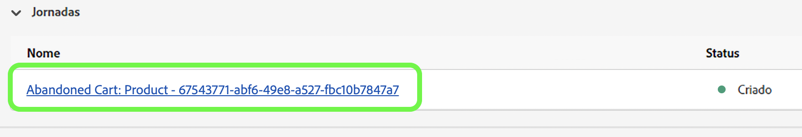
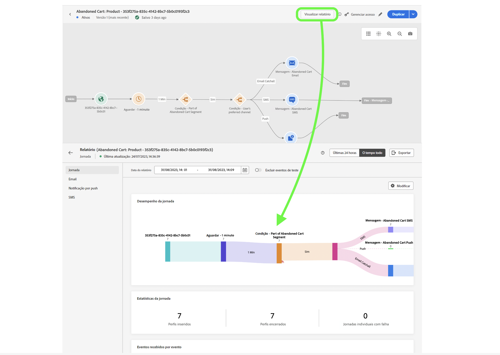

# Evento unitário

## Etapas a seguir {#steps-to-follow}

>[!CONTEXTUALHELP]
>id="marketerexp_sampledata_unitaryevent"
>title="Como usar?"
>abstract="Acesse o link para obter mais detalhes"

>[!IMPORTANT]
>
>Estas instruções podem mudar entre **[!UICONTROL manuais de estratégia]**. Consulte sempre a seção de dados de amostra do respectivo **[!UICONTROL manual de estratégia]**.

## Pré-requisito

* Use o manual de estratégia para criar ativos de instâncias como **[!UICONTROL Jornadas]**, **[!UICONTROL Esquemas]**, **[!UICONTROL Segmentos]**, **[!UICONTROL Mensagens]**, etc.

* Os ativos criados serão mostrados na página `Bill Of Material`

<!-- TODO: attached image needs to change once postman is removed from UI -->


>[!TIP]
>
>Se você estiver usando um terminal para executar os curls, poderá definir valores variáveis antes de executá-los, de modo que não haja necessidade de substituir esses valores em curls individuais.
>Por exemplo: se você definir `ORG_ID=************@AdobeOrg`, o shell substituirá automaticamente cada ocorrência de `$ORG_ID` com o valor, para que você possa copiar, colar e executar os curls abaixo sem qualquer modificação.
>
> As variáveis a seguir são usadas em todo este documento
>
> ACCESS_TOKEN
>
> API_KEY
>
> ORG_ID
>
> SANDBOX_NAME
>
> PROFILE_SCHEMA_REF
>
> PROFILE_DATASET_NAME
>
> PROFILE_DATASET_ID
>
> JOURNEY_ID
>
> PROFILE_BASE_CONNECTION_ID
>
> PROFILE_SOURCE_CONNECTION_ID
>
> PROFILE_TARGET_CONNECTION_ID
>
> PROFILE_INLET_URL
>
> CUSTOMER_MOBILE_NUMBER
>
> CUSTOMER_FIRST_NAME
>
> CUSTOMER_LAST_NAME
>
> EMAIL
>
> EVENT_SCHEMA_REF
>
> EVENT_DATASET_NAME
>
> EVENT_DATASET_ID
>
> EVENT_BASE_CONNECTION_ID
>
> EVENT_SOURCE_CONNECTION_ID
>
> EVENT_TARGET_CONNECTION_ID
>
> EVENT_INLET_URL
>
> TIMESTAMP
>
> UNIQUE_EVENT_ID

## Buscar token IMS

1. Siga a documentação [Autenticar e acessar APIs da Experience Platform](https://experienceleague.adobe.com/docs/experience-platform/landing/platform-apis/api-authentication.html?lang=pt-BR) para gerar o token de acesso.

## Publicar a jornada criada pelo manual de estratégia

Existem 2 maneiras de publicar a jornada. Você pode escolher qualquer uma delas:

1. **Usando a interface do AJO**: clique no link da jornada em `Bill Of Material Page`. Isso irá redirecioná-lo para a página da jornada, onde você poderá clicar no botão **[!UICONTROL Publicar]** e a jornada será publicada.

   

1. **Utilização do cURL**

   1. Publique a jornada. A resposta conterá a ID de processo necessária na próxima etapa para buscar o status de publicação da jornada.

      ```bash
      curl --location --request POST "https://journey-private.adobe.io/authoring/jobs/journeyVersions/$JOURNEY_ID/deploy" \
      --header "Accept: */*" \
      --header "Authorization: Bearer $ACCESS_TOKEN" \
      --header "x-api-key: $API_KEY" \
      --header "x-gw-ims-org-id: $ORG_ID" \
      --header "x-sandbox-name: $SANDBOX_NAME" \
      --header "Content-Type: application/json" 
      ```

   1. A publicação da jornada pode levar algum tempo, portanto, para verificar o status executado abaixo do cURL, até que o `response.status` seja `SUCCESS`, aguarde de 10 a 15 segundos se a publicação da jornada demorar.

      ```bash
      curl --location "https://journey-private.adobe.io/authoring/jobs/$JOB_ID" \
      --header "Authorization: Bearer $ACCESS_TOKEN" \
      --header "x-api-key: $API_KEY" \
      --header "x-gw-ims-org-id: $ORG_ID" \
      --header "x-sandbox-name: $SANDBOX_NAME" \
      --header "Content-Type: application/json"
      ```

## Assimilar o perfil do cliente

>[!TIP]
>
>Se o seu provedor de email for compatível com emails do Plus, você poderá reutilizar o mesmo endereço de email anexando `+<variable>` ao seu email. Por exemplo, `usertest@email.com` pode ser reutilizado como `usertest+v1@email.com` ou `usertest+24jul@email.com`. Isso é útil para criar um perfil novo a cada vez, mas ainda usando a mesma ID de email.
>
>P.S: os emails do Plus são um recurso configurável que precisa ser compatível com o provedor de email. Verifique se você consegue receber emails nesses endereços antes de usá-los no teste.

1. Usuários e usuárias iniciantes precisam criar o **[!DNL customer dataset]** e o **[!DNL HTTP Streaming Inlet Connection]**.
1. Se você já criou o **[!DNL customer dataset]** e o **[!DNL HTTP Streaming Inlet Connection]**, pule para a etapa `5`.
1. Crie um conjunto de dados de perfil do cliente executando o cURL abaixo.

   ```bash
   curl --location "https://platform.adobe.io/data/foundation/catalog/dataSet" \
   --header "Authorization: Bearer $ACCESS_TOKEN" \
   --header "x-gw-ims-org-id: $ORG_ID" \
   --header "x-sandbox-name: $SANDBOX_NAME" \
   --header "x-api-key: $API_KEY" \
   --header "Content-Type: application/json" \
   --data '{
       "name": "'$PROFILE_DATASET_NAME'",
       "schemaRef": {
           "id": "'$PROFILE_SCHEMA_REF'",
           "contentType": "application/vnd.adobe.xed-full-notext+json; version=1"
       },
       "tags": {
           "unifiedProfile": [
           "enabled:true"
           ],
           "unifiedIdentity": [
           "enabled:true"
           ]
       },
       "fileDescription": {
           "persisted": true,
           "containerFormat": "parquet",
           "format": "parquet"
       }
   }'
   ```

   A resposta terá o formato `"@/dataSets/<PROFILE_DATASET_ID>"`.

1. Crie **[!DNL HTTP Streaming Inlet Connection]** com a ajuda das etapas a seguir.
   1. Crie uma conexão básica.

      ```bash
      curl --location "https://platform.adobe.io/data/foundation/flowservice/connections?Cache-Control=no-cache" \
      --header "Authorization: Bearer $ACCESS_TOKEN" \
      --header "x-gw-ims-org-id: $ORG_ID" \
      --header "x-sandbox-name: $SANDBOX_NAME" \
      --header "x-api-key: $API_KEY" \
      --header "Content-Type: application/json" \
      --data '{
          "name": "AbandonedCartProduct_Base_ConnectionForCustomerProfile_1694458293",
          "description": "Marketer Playground Playbook-Validation Customer Profile Base Connection 1",
          "auth": {
              "specName": "Streaming Connection",
              "params": {
                  "dataType": "xdm"
              }
          },
          "connectionSpec": {
              "id": "bc7b00d6-623a-4dfc-9fdb-f1240aeadaeb",
              "version": "1.0"
          }
      }'
      ```

      Obter a ID de conexão básica da resposta e usá-la no lugar de `PROFILE_BASE_CONNECTION_ID` nos seguintes cURLs

   1. Criar conexão de origem.

      ```bash
      curl --location "https://platform.adobe.io/data/foundation/flowservice/sourceConnections" \
      --header "Authorization: Bearer $ACCESS_TOKEN" \
      --header "x-gw-ims-org-id: $ORG_ID" \
      --header "x-sandbox-name: $SANDBOX_NAME" \
      --header "Content-Type: application/json" \
      --header "x-api-key: $API_KEY" \
      --data '{
          "name": "AbandonedCartProduct_Source_ConnectionForCustomerProfile_1694458318",
          "description": "Marketer Playground Playbook-Validation Customer Profile Source Connection 1",
          "baseConnectionId": "'$PROFILE_BASE_CONNECTION_ID'",
          "connectionSpec": {
              "id": "bc7b00d6-623a-4dfc-9fdb-f1240aeadaeb",
              "version": "1.0"
          }
      }'
      ```

      Obter a ID de conexão de origem da resposta e usá-la no lugar de `PROFILE_SOURCE_CONNECTION_ID`

   1. Criar conexão de destino.

      ```bash
      curl --location "https://platform.adobe.io/data/foundation/flowservice/targetConnections" \
      --header "Authorization: Bearer $ACCESS_TOKEN" \
      --header "x-gw-ims-org-id: $ORG_ID" \
      --header "x-sandbox-name: $SANDBOX_NAME" \
      --header "Content-Type: application/json" \
      --header "x-api-key: $API_KEY" \
      --data '{
          "name": "AbandonedCartProduct_Target_ConnectionForCustomerProfile_1694458407",
          "description": "Marketer Playground Playbook-Validation Customer Profile Target Connection 1",
          "data": {
              "format": "parquet_xdm",
              "schema": {
                  "version": "application/vnd.adobe.xed-full+json;version=1",
                  "id": "'$PROFILE_SCHEMA_REF'"
              },
              "properties": null
          },
          "connectionSpec": {
              "id": "c604ff05-7f1a-43c0-8e18-33bf874cb11c",
              "version": "1.0"
          },
          "params": {
              "dataSetId": "'$PROFILE_DATASET_ID'"
          }
      }'
      ```

      Obter a id de conexão de destino da resposta e usá-la no lugar de `PROFILE_TARGET_CONNECTION_ID`

   1. Crie um fluxo de dados.

      ```bash
      curl --location "https://platform.adobe.io/data/foundation/flowservice/flows" \
      --header "Authorization: Bearer $ACCESS_TOKEN" \
      --header "x-gw-ims-org-id: $ORG_ID" \
      --header "x-sandbox-name: $SANDBOX_NAME" \
      --header "Content-Type: application/json" \
      --header "x-api-key: $API_KEY" \
      --data '{
          "name": "AbandonedCartProduct_Dataflow_ForCustomerCustomerProfile_1694460528",
          "description": "Marketer Playground Playbook-Validation Customer Profile Dataflow 1",
          "flowSpec": {
              "id": "d8a6f005-7eaf-4153-983e-e8574508b877",
              "version": "1.0"
          },
          "sourceConnectionIds": [
              "'$PROFILE_SOURCE_CONNECTION_ID'"
          ],
          "targetConnectionIds": [
              "'$PROFILE_TARGET_CONNECTION_ID'"
          ]
      }'
      ```

   1. Obter conexão básica. O resultado conterá o inletUrl necessário para enviar dados de perfil.

      ```bash
      curl --location "https://platform.adobe.io/data/foundation/flowservice/connections/$PROFILE_BASE_CONNECTION_ID" \
      --header "Authorization: Bearer $ACCESS_TOKEN" \
      --header "x-gw-ims-org-id: $ORG_ID" \
      --header "x-sandbox-name: $SANDBOX_NAME" \
      --header "Content-Type: application/json" \
      --header "x-api-key: $API_KEY"
      ```

      Obter o inletUrl da resposta e usá-lo no lugar de `PROFILE_INLET_URL`

1. Nesta etapa, o usuário deve ter valores de `PROFILE_DATASET_ID` e `PROFILE_INLET_URL`; caso contrário, consulte a etapa `3` ou `4` respectivamente.
1. Para assimilar clientes, o usuário precisa substituir `CUSTOMER_MOBILE_NUMBER`, `CUSTOMER_FIRST_NAME`, `CUSTOMER_LAST_NAME` e `EMAIL` nos cURLs abaixo.

   1. `CUSTOMER_MOBILE_NUMBER` seria o número do celular, por exemplo `+1 000-000-0000`
   1. `CUSTOMER_FIRST_NAME` seria o nome da pessoa
   1. `CUSTOMER_LAST_NAME` seria o sobrenome da pessoa
   1. `EMAIL` seria o endereço de email da pessoa. É crucial usar uma ID de email distinta para que um novo perfil possa ser assimilado.

1. Por fim, execute o curl para assimilar o perfil do cliente. Atualizar `body.xdmEntity.consents.marketing.preferred` para `email`, `sms` ou `push` com base nos canais que você pretende verificar. Também defina as `val` correspondentes como `y`.

   ```bash
   curl --location "$PROFILE_INLET_URL?synchronousValidation=true" \
   --header 'Content-Type: application/json' \
   --data-raw '{
       "header": {
           "schemaRef": {
               "id": "'$PROFILE_SCHEMA_REF'",
               "contentType": "application/vnd.adobe.xed-full+json;version=1.0"
           },
           "imsOrgId": "'$ORG_ID'",
           "datasetId": "'$PROFILE_DATASET_ID'",
           "source": {
               "name": "Streaming dataflow - 1694460605"
           }
       },
       "body": {
           "xdmMeta": {
               "schemaRef": {
                   "id": "'$PROFILE_SCHEMA_REF'",
                   "contentType": "application/vnd.adobe.xed-full+json;version=1.0"
               }
           },
           "xdmEntity": {
           "consents": {
               "marketing": {
                   "preferred": "email",
                   "email": {
                       "val": "y"
                   },
                   "push": {
                       "val": "n"
                   },
                   "sms": {
                       "val": "n"
                   }
               }
           },
           "mobilePhone": {
               "number": "'$CUSTOMER_MOBILE_NUMBER'",
               "status": "active"
           },
           "person": {
               "name": {
               "firstName": "'$CUSTOMER_FIRST_NAME'",
               "lastName": "'$CUSTOMER_LAST_NAME'"
               }
           },
           "personalEmail": {
               "address": "'$EMAIL'"
           },
           "testProfile": false
           }
       }
   }'
   ```

## Evento do acionador de jornada de assimilação

1. Usuários e usuárias iniciantes precisam criar o **[!DNL event dataset]** e o **[!DNL HTTP Streaming Inlet Connection for events]**
1. Se você já criou o **[!DNL event dataset]** e o **[!DNL HTTP Streaming Inlet Connection for events]**, pule para a etapa `5`.
1. Crie um conjunto de dados de evento executando o cURL abaixo.

   ```bash
   curl --location "https://platform.adobe.io/data/foundation/catalog/dataSet" \
   --header "Authorization: Bearer $ACCESS_TOKEN" \
   --header "x-gw-ims-org-id: $ORG_ID" \
   --header "x-sandbox-name: $SANDBOX_NAME" \
   --header "x-api-key: $API_KEY" \
   --header "Content-Type: application/json" \
   --data '{
       "name": "'$EVENT_DATASET_NAME'",
       "schemaRef": {
           "id": "'$EVENT_SCHEMA_REF'",
           "contentType": "application/vnd.adobe.xed-full-notext+json; version=1"
       },
       "tags": {
           "unifiedProfile": [
               "enabled:true"
           ],
           "unifiedIdentity": [
               "enabled:true"
           ]
       },
       "fileDescription": {
           "persisted": true,
           "containerFormat": "parquet",
           "format": "parquet"
       }
   }'
   ```

   A resposta terá o formato `"@/dataSets/<EVENT_DATASET_ID>"`

1. Crie **[!DNL HTTP Streaming Inlet Connection for events]**  com a ajuda das etapas a seguir.
   <!-- TODO: Is the name unique? If so, we may need to generate and provide in variables.txt-->
   1. Crie uma conexão básica.

      ```bash
      curl --location "https://platform.adobe.io/data/foundation/flowservice/connections?Cache-Control=no-cache" \
      --header "Authorization: Bearer $ACCESS_TOKEN" \
      --header "x-gw-ims-org-id: $ORG_ID" \
      --header "x-sandbox-name: $SANDBOX_NAME" \
      --header "x-api-key: $API_KEY" \
      --header "Content-Type: application/json" \
      --data '{
          "name": "AbandonedCartProduct_Base_ConnectionForAEPDemoSchema_1694461448",
          "description": "Marketer Playground Playbook-Validation AEP Demo Schema Base Connection 1",
          "auth": {
              "specName": "Streaming Connection",
              "params": {
                  "dataType": "xdm"
              }
          },
          "connectionSpec": {
              "id": "bc7b00d6-623a-4dfc-9fdb-f1240aeadaeb",
              "version": "1.0"
          }
      }'
      ```

      Obter a ID de conexão básica da resposta e usá-la no lugar de `EVENT_BASE_CONNECTION_ID`

   1. Criar conexão de origem.

      ```bash
      curl --location "https://platform.adobe.io/data/foundation/flowservice/sourceConnections" \
      --header "Authorization: Bearer $ACCESS_TOKEN" \
      --header "x-gw-ims-org-id: $ORG_ID" \
      --header "x-sandbox-name: $SANDBOX_NAME" \
      --header "x-api-key: $API_KEY" \
      --header "Content-Type: application/json" \
      --data '{
          "name": "AbandonedCartProduct_Source_ConnectionForAEPDemoSchema_1694461464",
          "description": "Marketer Playground Playbook-Validation AEP Demo Schema Source Connection 1",
          "baseConnectionId": "'$EVENT_BASE_CONNECTION_ID'",
          "connectionSpec": {
              "id": "bc7b00d6-623a-4dfc-9fdb-f1240aeadaeb",
              "version": "1.0"
          }
      }'
      ```

      Obter a ID de conexão de origem da resposta e usá-la no lugar de `EVENT_SOURCE_CONNECTION_ID`

   1. Criar conexão de destino.

      ```bash
      curl --location "https://platform.adobe.io/data/foundation/flowservice/sourceConnections" \
      --header "Authorization: Bearer $ACCESS_TOKEN" \
      --header "x-gw-ims-org-id: $ORG_ID" \
      --header "x-sandbox-name: $SANDBOX_NAME" \
      --header "x-api-key: $API_KEY" \
      --header "Content-Type: application/json" \
      --data '{
          "name": "AbandonedCartProduct_Target_ConnectionForAEPDemoSchema_1694802667",
          "description": "Marketer Playground Playbook-Validation AEP Demo Schema Target Connection 1",
          "data": {
              "format": "parquet_xdm",
              "schema": {
                  "version": "application/vnd.adobe.xed-full+json;version=1",
                  "id": "'$EVENT_SCHEMA_REF'"
              },
              "properties": null
          },
          "connectionSpec": {
              "id": "c604ff05-7f1a-43c0-8e18-33bf874cb11c",
              "version": "1.0"
          },
          "params": {
              "dataSetId": "'$EVENT_DATASET_ID'"
          }
      }'
      ```

      Obter a id de conexão de destino da resposta e usá-la no lugar de `EVENT_TARGET_CONNECTION_ID`

   1. Crie um fluxo de dados.

      ```bash
      curl --location "https://platform.adobe.io/data/foundation/flowservice/flows" \
      --header "Authorization: Bearer $ACCESS_TOKEN" \
      --header "x-gw-ims-org-id: $ORG_ID" \
      --header "x-sandbox-name: $SANDBOX_NAME" \
      --header "x-api-key: $API_KEY" \
      --header "Content-Type: application/json" \
      --data '{
          "name": "AbandonedCartProduct_Dataflow_ForCustomerAEPDemoSchema_1694461564",
          "description": "Marketer Playground Playbook-Validation AEP Demo Schema Dataflow 1",
          "flowSpec": {
              "id": "d8a6f005-7eaf-4153-983e-e8574508b877",
              "version": "1.0"
          },
          "sourceConnectionIds": [
              "'$EVENT_SOURCE_CONNECTION_ID'"
          ],
          "targetConnectionIds": [
              "'$EVENT_TARGET_CONNECTION_ID'"
          ]
      }'
      ```

   1. Obter conexão básica. O resultado conterá o inletUrl necessário para enviar dados de perfil.

   ```bash
   curl --location "https://platform.adobe.io/data/foundation/flowservice/connections/$EVENT_BASE_CONNECTION_ID" \
       --header "Authorization: Bearer $ACCESS_TOKEN" \
       --header "x-gw-ims-org-id: $ORG_ID" \
       --header "x-sandbox-name: $SANDBOX_NAME" \
       --header "x-api-key: $API_KEY" \
       --header "Content-Type: application/json" 
   ```

   Obter o inletUrl da resposta e usá-lo no lugar de `EVENT_INLET_URL`

1. Nesta etapa, é preciso ter valores de `EVENT_DATASET_ID` e `EVENT_INLET_URL`; caso contrário, consulte a etapa `3` ou `4` respectivamente.
1. Para assimilar o evento, é necessário alterar a variável de tempo `TIMESTAMP` no corpo da solicitação do cURL abaixo.

   1. Substitua `body.xdmEntity` pelo conteúdo do json do evento baixado.
   1. `TIMESTAMP` seria o horário de ocorrência do evento; use o carimbo de data e hora no fuso horário UTC, por exemplo. `2023-09-05T23:57:00.071+00:00`.
   1. Defina um valor único para a variável `UNIQUE_EVENT_ID`.

   ```bash
   curl --location "$EVENT_INLET_URL?synchronousValidation=true" \
   --header 'Content-Type: application/json' \
   --data-raw '{
       "header": {
           "schemaRef": {
               "id": "'$EVENT_SCHEMA_REF'",
               "contentType": "application/vnd.adobe.xed-full+json;version=1.0"
           },
           "imsOrgId": "'$ORG_ID'",
           "datasetId": "'$EVENT_DATASET_ID'",
           "source": {
               "name": "Streaming dataflow - 8/31/2023 9:04:25 PM"
           }
       },
       "body": {
           "xdmMeta": {
               "schemaRef": {
                   "id": "'$EVENT_SCHEMA_REF'",
                   "contentType": "application/vnd.adobe.xed-full+json;version=1.0"
               }
           },
           "xdmEntity": {
               "endUserIDs": {
                   "_experience": {
                       "aaid": {
                           "id": "'$EMAIL'"
                       },
                       "emailid": {
                           "id": "'$EMAIL'"
                       }
                   }
               },
               "_experience": {
                   "analytics": {
                       "customDimensions": {
                           "eVars": {
                           "eVar235": "AC11147"
                           }
                       }
                   }
               },
               "_id": "'$UNIQUE_EVENT_ID'",
               "commerce": {
                   "productListAdds": {
                       "value": 11498
                   }
               },
               "eventType": "commerce.productListAdds",
               "productListItems": [
                   {
                       "_id": "ACS1620",
                       "SKU": "P1",
                       "_experience": {
                           "analytics": {
                           "customDimensions": {
                               "eVars": {
                                   "eVar1": "Pants"
                               }
                           }
                           }
                       },
                       "currencyCode": "USD",
                       "name": "Sample value",
                       "priceTotal": 30841.13,
                       "product": "https://ns.adobe.com/xdm/common/uri",
                       "productAddMethod": "Sample value",
                       "quantity": 1
                   },
                   {
                       "_id": "ACS1729",
                       "SKU": "P2",
                       "_experience": {
                           "analytics": {
                               "customDimensions": {
                                   "eVars": {
                                       "eVar1": "Galliano"
                                   }
                               }
                           }
                       },
                       "currencyCode": "USD",
                       "name": "Sample value",
                       "priceTotal": 20841.13,
                       "product": "https://ns.adobe.com/xdm/common/uri",
                       "productAddMethod": "Sample value",
                       "quantity": 2
                   }
               ],
               "timestamp": "'$TIMESTAMP'",
               "web": {
                   "webInteraction": {
                       "URL": "https://experienceleague.adobe.com/docs/experience-platform/edge/data-collection/collect-commerce-data.html?lang=pt-BR",
                       "name": "Sample value",
                       "region": "Sample value"
                   },
                   "webPageDetails": {
                       "URL": "https://experienceleague.adobe.com/docs/experience-platform/edge/data-collection/collect-commerce-data.html?lang=pt-BR",
                       "isErrorPage": false,
                       "isHomePage": false,
                       "name": "Sample value",
                       "pageViews": {
                           "id": "Sample value",
                           "value": 1
                       },
                       "server": "Sample value",
                       "siteSection": "Sample value",
                       "viewName": "Sample value"
                   },
                   "webReferrer": {
                   "URL": "Sample value",
                   "type": "internal"
                   }
               }
           }
       }
   }'
   ```

## Validação final

É necessário receber uma mensagem no canal de sua preferência selecionado, usado na etapa `8` do **[!DNL Ingest the Customer Profile]**

* `SMS` se o canal preferido for `sms` em `customer_country_code` e `customer_mobile_no`
* `Email` se o canal preferido for `email` em `email`

Também é possível verificar o `Journey Report`. Para verificá-lo, clique em `Journey Object` na `Bill of Materials page`, isso irá redirecioná-lo para `Journey Details page`.

Em qualquer jornada publicada, é necessário obter um botão **[!UICONTROL Exibir relatório]** 



## Limpar

Não tenha múltiplas instâncias do `Journey` executando simultaneamente. Interrompa a jornada se for apenas para validação assim que esta for concluída.
